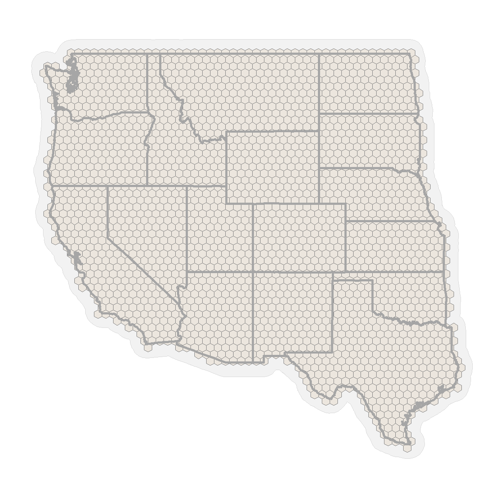

Grasshoppers Exhibit Asynchrony and Spatial Non-Stationarity in Response
to the El Nino/Southern and Pacific Decadal Oscillations
================
John M Humphreys
2022-05-12

# Overview

Taking steps to account for data collection biases, mediating effects,
and variable confounding, we assessed the influence of natural climate
oscillations on a 40-year record of grasshopper density in the Western
US. Central to our analysis was employing spatially varying coefficients
to model time and location-specific variation in grasshopper response to
climate. Our results quantitatively demonstrated interannual changes in
grasshopper density to be effected by seasonal El Nino/Southern
Oscillation (ENSO) and Pacific Decadal Oscillation (PDO) variability and
to exhibit spatial asynchrony and non-stationarity such that the
relative influence of climate on grasshopper density varied through time
and across geographic space.

This script provides code that demonstrates the general workflow and
modeling framework used for analysis. Full models as described in the
publication were executed using Integrated Laplace Approximation
([Håvard Rue, Martino, and Chopin 2009](#ref-Rue2009); [Lindgren and Rue
2015](#ref-Lindgren2015)) and required approximately 10 days of run time
on high-performance computers using 24 CPUs at 40GB memory, as well as,
licensed PARDISO solver software ([Verbosio et al. 2017](#ref-Pardiso1);
[Kourounis, Fuchs, and Schenk 2018](#ref-Pardiso2)).

For full description of the study, please see the associated article:  
**Humphreys JM, Srygley RB, Lawton D, Hudson A, and Branson DH, 2022.
Grasshoppers Exhibit Asynchrony and Spatial Non-Stationarity in Response
to the El Nino/Southern and Pacific Decadal Oscillations (in review)**

For data and code to run this analysis, please see the project Open
Science Framework website: <https://osf.io/dmyhf/>

# Libraries

Loading required packages for statistical analysis.

``` r
suppressMessages(library(rgdal))
suppressMessages(library(rgeos))
suppressMessages(library(maptools))
suppressMessages(library(mapproj))
suppressMessages(library(spdep))
suppressMessages(library(sp))
suppressMessages(library(ggplot2))
suppressMessages(library(GISTools))
suppressMessages(library(dplyr))
suppressMessages(library(viridis))
suppressMessages(library(kableExtra))
suppressMessages(library(dagitty))
suppressMessages(library(ggdag))
suppressMessages(library(INLA))
```

# Study Area

Defining the spatial domain used in the study.

``` r
LL84 = "+proj=longlat +datum=WGS84 +no_defs +ellps=WGS84 +towgs84=0,0,0"

nProj = "+proj=merc +a=6378137 +b=6378137 +lat_ts=0 +lon_0=0
         +x_0=0 +y_0=0 +k=1 +units=km +nadgrids=@null +no_defs"

States = map("state", fill = TRUE, plot = FALSE)


IDs = sapply(strsplit(States$names, ":"), function(x) x[1])

States = map2SpatialPolygons(States, IDs = IDs, proj4string = CRS(LL84))

pid = sapply(slot(States, "polygons"), function(x) slot(x, "ID"))

p.df = data.frame(ID = 1:length(States), row.names = pid)

States = SpatialPolygonsDataFrame(States, p.df)
States = spTransform(States, nProj)

States$NAME = rownames(States@data)

West.states = subset(States, NAME == "arizona" | NAME == "california" | NAME == "colorado" |
    NAME == "idaho" | NAME == "kansas" | NAME == "montana" | NAME == "nebraska" |
    NAME == "nevada" | NAME == "new mexico" | NAME == "north dakota" | NAME == "oklahoma" |
    NAME == "oregon" | NAME == "south dakota" | NAME == "texas" | NAME == "utah" |
    NAME == "washington" | NAME == "wyoming")
```

Western US  
Study Area

``` r
West.fort = fortify(West.states)
States.fort = fortify(States)

ggplot(States.fort, aes(long, lat, group = group)) + geom_polygon(col = "gray85",
    fill = "gray95", size = 0.1) + geom_polygon(data = West.fort, aes(long, lat,
    group = group), fill = "gray85", col = "gray65", size = 1) + xlab(" ") + ylab(" ") +
    coord_equal() + theme(panel.grid.minor = element_blank(), panel.grid.major = element_blank(),
    panel.background = element_blank(), plot.background = element_blank(), panel.border = element_blank(),
    legend.direction = "horizontal", legend.position = "bottom", strip.text = element_text(size = 12,
        face = "bold"), strip.background = element_blank(), legend.key = element_blank(),
    legend.key.size = unit(5, "line"), legend.key.width = unit(3, "line"), legend.text = element_text(size = 12,
        face = "bold"), legend.title = element_text(size = 18, face = "bold"), axis.title.x = element_blank(),
    axis.title.y = element_blank(), axis.text.x = element_blank(), axis.text.y = element_blank(),
    axis.ticks.x = element_blank(), axis.ticks.y = element_blank(), plot.title = element_blank())
```


# Hexagon Grid

Constructing a regular, hexagon grid to cover the study domain.

``` r
States.buffer = gBuffer(West.states, width = 120, byid = FALSE)

size = 65  #cell center distance km

set.seed(1976)
hex_points = spsample(States.buffer, type = "hexagonal", cellsize = size)

hex_grid = HexPoints2SpatialPolygons(hex_points, dx = size)
hex_grid$States = over(hex_grid, West.states)[, "NAME"]

hex_grid = subset(hex_grid, is.na(States) == FALSE)

# Add a data frame
pid = sapply(slot(hex_grid, "polygons"), function(x) slot(x, "ID"))

p.df = data.frame(ID = 1:length(hex_grid), row.names = pid)

hex_grid = SpatialPolygonsDataFrame(hex_grid, p.df)

hex_grid$Area = gArea(hex_grid, byid = T)
hex_grid$Region = 1:dim(hex_grid@data)[1]
```

View Grid

``` r
Buffer.fort = fortify(States.buffer)

hex_grid@data$id = rownames(hex_grid@data)
hex.fort = fortify(hex_grid, region = "id")
hex.fort = left_join(hex.fort, hex_grid@data, by = "id")


ggplot(Buffer.fort, aes(long, lat, group = group)) + geom_polygon(col = "gray85",
    fill = "gray95", size = 0.1) + geom_polygon(data = hex.fort, aes(long, lat, group = group),
    fill = "tan", alpha = 0.2, col = "gray50", size = 0.1) + geom_polygon(data = West.fort,
    aes(long, lat, group = group), fill = "transparent", col = "gray65", size = 1) +
    xlab(" ") + ylab(" ") + coord_equal() + theme(panel.grid.minor = element_blank(),
    panel.grid.major = element_blank(), panel.background = element_blank(), plot.background = element_blank(),
    panel.border = element_blank(), legend.direction = "horizontal", legend.position = "bottom",
    strip.text = element_text(size = 12, face = "bold"), strip.background = element_blank(),
    legend.key = element_blank(), legend.key.size = unit(5, "line"), legend.key.width = unit(3,
        "line"), legend.text = element_text(size = 12, face = "bold"), legend.title = element_text(size = 18,
        face = "bold"), axis.title.x = element_blank(), axis.title.y = element_blank(),
    axis.text.x = element_blank(), axis.text.y = element_blank(), axis.ticks.x = element_blank(),
    axis.ticks.y = element_blank(), plot.title = element_blank())
```



# Neighborhood Adjacency

Spatial neighborhood graph identifies hexagon cells with shared
boundaries.

``` r
nb = poly2nb(hex_grid, queen = TRUE)

nb2INLA("J", nb)
J = inla.read.graph("J")
```

View

``` r
plot(hex_grid, col = "transparent", border = "brown")
xy = sp::coordinates(hex_grid)
plot(nb, xy, col = "gray30", cex = 0.25, lwd = 0.1, add = TRUE)
```


# Grasshopper Data

Simulated grasshopper densities and environmental data. This analysis
will focus on assessing the ONI as a Spatially Varying Coefficient
during the winter season. The full model concurrently models the ONI,
PDO, temperature, and precipitation as SVCs over a 40 year period across
all seasons. Code and and data are available at the OSF:
<https://osf.io/dmyhf/>

``` r
data_df = read.csv("gh_demo_data.csv", stringsAsFactors = FALSE, header = TRUE, sep = ",")

head(data_df)
```

      Density Region Year Effort     s_DEM oni.win pdo.win temp.win     ppt.win
    1      NA      1 2018      0 -1.443600      -1     0.4 1.811523 -0.34557910
    2      NA      2 2018      0 -1.512893      -1     0.4 1.831872 -0.34740360
    3      NA      3 2018      0 -1.552669      -1     0.4 1.904506  0.23440890
    4      NA      4 2018      0 -1.567535      -1     0.4 1.901868 -0.07796635
    5      NA      5 2018      0 -1.422119      -1     0.4 1.769282 -0.19237840
        ndvi.win   spei.win     s_PH     s_CARB    s_pCult
    1  0.4461400  0.5969603 1.247498 -0.7831283  0.5749373
    2  0.5785714  0.6371817 1.098715 -0.7795690  1.0205500
    3  0.2471770  0.2406306 1.080366 -0.6254268  1.1254280
    4 -1.6103970 -0.3286530 1.366663 -0.6535129 -0.6800718
    5  0.4739897  0.9587697 1.173583 -0.7912701  0.0841889
     [ reached 'max' / getOption("max.print") -- omitted 1 rows ]

View Simulated Grasshopper Densities

``` r
unique(data_df$Year)
```

    [1] 2018 2019 2020

``` r
match.set = data_df %>%
    dplyr::select(Year, Region, Density)

hex.2020 = hex.2019 = hex.2018 = hex.fort
hex.2020$Year = 2020
hex.2019$Year = 2019
hex.2018$Year = 2018
hex.yrs = rbind(hex.2020, hex.2019, hex.2018)

hex.yrs = left_join(hex.yrs, match.set, by = c("Year", "Region"))

ggplot(hex.yrs, aes(long, lat, group = group, fill = Density)) + geom_polygon(col = "gray85") +
    scale_fill_viridis(name = "Simulated GH Density", discrete = F, option = "inferno",
        direction = -1, na.value = "white") + geom_polygon(data = West.fort, aes(long,
    lat, group = group), fill = "transparent", col = "gray65", size = 1) + xlab(" ") +
    ylab(" ") + facet_wrap(~Year, ncol = 3) + coord_equal() + theme(panel.grid.minor = element_blank(),
    panel.grid.major = element_blank(), panel.background = element_blank(), plot.background = element_blank(),
    panel.border = element_blank(), legend.position = "bottom", strip.text = element_text(size = 25,
        face = "bold"), strip.background = element_blank(), legend.key = element_blank(),
    legend.key.size = unit(1, "line"), legend.key.width = unit(3, "line"), legend.text = element_text(size = 12,
        face = "bold"), legend.title = element_text(size = 18, face = "bold"), axis.title.x = element_blank(),
    axis.title.y = element_blank(), axis.text.x = element_blank(), axis.text.y = element_blank(),
    axis.ticks.x = element_blank(), axis.ticks.y = element_blank(), plot.title = element_blank()) +
    guides(fill = guide_colourbar(title.position = "top", title.hjust = 0.5))
```


# Directed Acyclic Graph (DAG)

Complete causal analysis is provided in the publication and at the OSF
site (<https://osf.io/dmyhf/>), here we plot the DAG as a general
refrence in interpreting data variables.

``` r
GH1 = dagitty("dag {
bb=\"0,0,1,1\"
Cult [pos=\"0.738,0.694\"]
D [pos=\"0.409,0.447\"]
E [pos=\"0.311,0.328\"]
ENSO [exposure,pos=\"0.158,0.456\"]
GH_obs [outcome,pos=\"0.843,0.472\"]
GH_true [latent,pos=\"0.643,0.468\"]
Inter [latent,pos=\"0.620,0.627\"]
Intra [latent,pos=\"0.497,0.684\"]
OC [pos=\"0.876,0.198\"]
P [pos=\"0.366,0.657\"]
PDO [exposure,pos=\"0.160,0.166\"]
PH [pos=\"0.845,0.066\"]
Pred [latent,pos=\"0.769,0.570\"]
S [latent,pos=\"0.768,0.238\"]
T [pos=\"0.369,0.086\"]
U [latent,pos=\"0.896,0.369\"]
V [pos=\"0.709,0.085\"]
Cult -> GH_true
D -> GH_true
D -> S
D -> V
E -> GH_true
E -> P
E -> S
E -> T
E -> V
ENSO -> P
ENSO -> T
GH_true -> GH_obs
Inter -> GH_true
Intra -> GH_true
OC -> S
P -> D
P -> GH_true
P -> S
P -> V
PDO -> P
PDO -> T
PH -> S
Pred -> GH_true
S -> GH_true
T -> D
T -> GH_true
T -> S
T -> V
U -> GH_obs
V -> GH_true
V -> S
}")
```

View DAG

``` r
tidy_dag = tidy_dagitty(GH1)
ggdag_status(tidy_dag, layout = "nicely") + scale_color_manual(values = c("tan",
    "gray85", "orange")) + geom_dag_text(col = "gray10") + theme_dag()
```


# Statistical Model

Still working to figure-out how rendering LaTeX math-stat notation works
on GitHub… Formulas and interactive tables are available with the full
html at RPubs: <https://rpubs.com/JMHumphreys/asynchrony>

# Organize Data

Create Year Index as integer.

``` r
data_df$Year1 = as.integer(as.factor(data_df$Year))

range(data_df$Year)
```

    [1] 2018 2020

``` r
range(data_df$Year1)
```

    [1] 1 3

Observation Level

Because not all variables are of the same format and dimensions, data is
organized as a list object. For the observation part of the data, this
is called the “observation stack” and shown as observation.stk.

``` r
obs.var =  list(list(alpha.1 = rep(1, dim(data_df)[1])), #intercept
                list(t.1 = data_df[,"Year1"], #time steps
                     zeta.1 = data_df[,"Region"], #spatiotemporal field  
                     varphi.1 = data_df[,"Region"])) #individual variation

data_df$y.1 = ifelse(data_df$Density > 0, 1, 0) #Survey conducted = 1, not conducted = 0
data_df$y.1[is.na(data_df$y.1)] = 0
sum(data_df$y.1) 
```

    [1] 3350

``` r
observation.stk = inla.stack(data = list(Y = cbind(data_df$y.1, NA)), #y.1 id first part of the bivariate response 
                                A = list(1,1), 
                          effects = obs.var,   
                              tag = "observation")
```

Grasshopper Density Level  
Similar to the observation stack, data for grasshopper density is
organized as a list. These variable names/labels correspond to those
presented in the publication and as shown in the Directed Acyclic Graph
(DAG) used as a causal analysis heuristic.

``` r
dens.var =  list(list(alpha.2 = rep(1, dim(data_df)[1])), #intercept
                  list(Effort = data_df[,"Effort"], #sampling effort
                       E = data_df[,"s_DEM"], #elevation
                       PH = data_df[,"s_PH"], #soil pH
                       OC = data_df[,"s_CARB"], #soil organic carbon
                       Cult = data_df[,"s_pCult"], #cultivated area
                       V = data_df[,"ndvi.win"], #vegetation
                       D = data_df[,"spei.win"], #drought
                       ONI = data_df[,"oni.win"], #winter ONI index from NOAA
                       PDO = data_df[,"pdo.win"], #winter PDO index
                       T = data_df[,"temp.win"], #winter temperature
                       P = data_df[,"ppt.win"], #winter precipitation
                       t.2a = data_df[,"Year1"], #time steps
                       t.2b = data_df[,"Year1"], #time steps (extra copy)
                       t.2c = data_df[,"Year1"], #time steps (extra copy)
                       zeta.2 = data_df[,"Region"], #spatiotemporal effect for latencies
                       S = data_df[,"Region"], #for copy of shared spatial field
                       xi = data_df[,"Region"], #Spatiaotemporal SVC index
                       varphi.2 = data_df[,"Region"])) #individual variation

data_df$y.2 = data_df$Density
range(data_df$y.2, na.rm=T) #un-surveyed locations are NA 
```

    [1]  0.4180602 25.0836120

``` r
density.stk = inla.stack(data = list(Y = cbind(NA, data_df$y.2)), #second part of bivariate response  
                                   A = list(1,1), 
                             effects = dens.var,   
                                 tag = "density")
```

Combine Observation and Density Levels  
Data from both the observation and desnity parts of the model are
combined.

``` r
Joint.stk = inla.stack(observation.stk, density.stk)
```

# Run Model

Check bivariate response Variable. Check 12 rows at random. Region lists
cell ID numbers, Year is survey year, y.1 indicates if a  
survey was conducted (1 = yes, 0 = no) and y.2 is grasshopper density
(if surveyed).

``` r
set.seed(1)
data_df[sample(nrow(data_df), 12), ] %>%
    dplyr::select(Region, Year, y.1, y.2) %>%
    knitr::kable(caption = "Grasshopper densities at un-surveyed locations (y.1 = 0) are unknown (y.2 = NA).")
```

<table>
<caption>
Grasshopper densities at un-surveyed locations (y.1 = 0) are unknown
(y.2 = NA).
</caption>
<thead>
<tr>
<th style="text-align:left;">
</th>
<th style="text-align:right;">
Region
</th>
<th style="text-align:right;">
Year
</th>
<th style="text-align:right;">
y.1
</th>
<th style="text-align:right;">
y.2
</th>
</tr>
</thead>
<tbody>
<tr>
<td style="text-align:left;">
1017
</td>
<td style="text-align:right;">
1017
</td>
<td style="text-align:right;">
2018
</td>
<td style="text-align:right;">
1
</td>
<td style="text-align:right;">
0.8361204
</td>
</tr>
<tr>
<td style="text-align:left;">
4775
</td>
<td style="text-align:right;">
85
</td>
<td style="text-align:right;">
2020
</td>
<td style="text-align:right;">
0
</td>
<td style="text-align:right;">
NA
</td>
</tr>
<tr>
<td style="text-align:left;">
2177
</td>
<td style="text-align:right;">
2177
</td>
<td style="text-align:right;">
2018
</td>
<td style="text-align:right;">
1
</td>
<td style="text-align:right;">
13.3779264
</td>
</tr>
<tr>
<td style="text-align:left;">
5026
</td>
<td style="text-align:right;">
336
</td>
<td style="text-align:right;">
2020
</td>
<td style="text-align:right;">
0
</td>
<td style="text-align:right;">
NA
</td>
</tr>
<tr>
<td style="text-align:left;">
1533
</td>
<td style="text-align:right;">
1533
</td>
<td style="text-align:right;">
2018
</td>
<td style="text-align:right;">
0
</td>
<td style="text-align:right;">
NA
</td>
</tr>
<tr>
<td style="text-align:left;">
4567
</td>
<td style="text-align:right;">
2222
</td>
<td style="text-align:right;">
2019
</td>
<td style="text-align:right;">
1
</td>
<td style="text-align:right;">
5.4347826
</td>
</tr>
<tr>
<td style="text-align:left;">
2347
</td>
<td style="text-align:right;">
2
</td>
<td style="text-align:right;">
2019
</td>
<td style="text-align:right;">
0
</td>
<td style="text-align:right;">
NA
</td>
</tr>
<tr>
<td style="text-align:left;">
270
</td>
<td style="text-align:right;">
270
</td>
<td style="text-align:right;">
2018
</td>
<td style="text-align:right;">
1
</td>
<td style="text-align:right;">
2.5083612
</td>
</tr>
<tr>
<td style="text-align:left;">
4050
</td>
<td style="text-align:right;">
1705
</td>
<td style="text-align:right;">
2019
</td>
<td style="text-align:right;">
1
</td>
<td style="text-align:right;">
0.8361204
</td>
</tr>
<tr>
<td style="text-align:left;">
5307
</td>
<td style="text-align:right;">
617
</td>
<td style="text-align:right;">
2020
</td>
<td style="text-align:right;">
0
</td>
<td style="text-align:right;">
NA
</td>
</tr>
<tr>
<td style="text-align:left;">
3379
</td>
<td style="text-align:right;">
1034
</td>
<td style="text-align:right;">
2019
</td>
<td style="text-align:right;">
0
</td>
<td style="text-align:right;">
NA
</td>
</tr>
<tr>
<td style="text-align:left;">
4065
</td>
<td style="text-align:right;">
1720
</td>
<td style="text-align:right;">
2019
</td>
<td style="text-align:right;">
0
</td>
<td style="text-align:right;">
NA
</td>
</tr>
</tbody>
</table>

Model Formula

``` r
norm.prior = list(theta=list(prior = "normal", param=c(0, 3)))
pcprior1 = list(prec = list(prior="pc.prec", param = c(1, 0.001))) #priors

Frm.j = Y ~ -1 + alpha.1 + #intercepts
                 alpha.2 +
                    f(zeta.1, #observation level spatiotemporal for latencies
                      model="besag", #Besag model
                      graph = J, #adjacency matrix
                      group = t.1, #temporal structure (i.e., separate realization for each time step)
                      scale.model=TRUE,
                      constr=TRUE, #constrain field to zero
                      control.group = list(model = "ar1")) + #autoregressive prior
                    f(zeta.2, #density level spatiotemporal for latencies
                      model="besag", 
                      graph = J, 
                      group = t.2a , 
                      scale.model=TRUE,
                      constr=TRUE,
                      control.group = list(model = "ar1")) +
                    f(S,    #shares field, copy from observation level
                      copy = "zeta.1",
                      fixed = FALSE, 
                      group = t.2b) + 
                    f(xi, ONI, #spatiotemporal SVC weighted by the ONI index
                      model="besag", 
                      graph = J, 
                      group = t.2c, 
                      scale.model=TRUE,
                      constr=FALSE, #do not constrain field to zero
                      control.group = list(model = "ar1")) +
                    f(varphi.1, #individual variation
                      model="iid", #independent and identically distributed
                      constr=TRUE,
                      hyper=norm.prior) +
                    f(varphi.2, 
                      model="iid", 
                      constr=TRUE,
                      hyper=norm.prior) +
                    E + Effort + PH + OC + Cult + V + D #environmental effects and effort
```

Run Model

``` r
theta.1 = c(3.31254482, -3.07086277, 2.29563236, 0.45380020, 0.46629706, 2.48823476, 1.18624377, 3.10314798, 3.10314798, 0.04833974)

Model.1 = inla(Frm.j, #formula
                     num.threads = 12, #number of CPUs 
                     data = inla.stack.data(Joint.stk), #data
                     family = c("binomial", "gamma"), #distributions
                     verbose = FALSE, #print progress to screen
                     control.fixed = list(prec = 1, prec.intercept=1),  #intercept priors
                     control.predictor = list(
                                                 A = inla.stack.A(Joint.stk), #projection matrix (placeholder only here)
                                         compute = TRUE, #estimate fitted values
                                              link = 1),  #default link
                     control.mode = list(restart = TRUE, theta = theta.1), #above means from previous run to speed-up
                     control.inla = list(strategy="adaptive",             #strategy to speed up 
                                                   int.strategy = "eb"), #use mode to reduce resources/run time
                     control.compute=list(dic = FALSE, cpo = FALSE, waic = FALSE)) #comparative indices to calculate
```

# Results

Although greatly reduced and simplified, the above model may take a long
time to run on desktops and laptops (about 90min). A copy of the model
outputs and results (“RES_demo.RData”) are provided with the data and
code at the OSF site: <https://osf.io/dmyhf/>

Load previoulsy run model above:

``` r
load("RES_demo.RData")
```

Pull Fitted Estimates

``` r
idat = inla.stack.index(Joint.stk, "density")$data
data_df$Fitted = exp(Model.1$summary.fitted.values$mean[idat])
cor(data_df$Density, data_df$Fitted, use = "pairwise.complete")
```

    [1] 0.995774

As done prior to running model, check bivariate response variable; but
this time, in relation to fitted estimates. Check 12 rows at random.

``` r
set.seed(1)
data_df[sample(nrow(data_df), 12), ] %>%
    dplyr::select(Region, Year, y.1, y.2, Fitted) %>%
    knitr::kable(caption = "Grasshopper fitted densities (un-surveyed locations were unknown (y.2 = NA).")
```

<table>
<caption>
Grasshopper fitted densities (un-surveyed locations were unknown (y.2 =
NA).
</caption>
<thead>
<tr>
<th style="text-align:left;">
</th>
<th style="text-align:right;">
Region
</th>
<th style="text-align:right;">
Year
</th>
<th style="text-align:right;">
y.1
</th>
<th style="text-align:right;">
y.2
</th>
<th style="text-align:right;">
Fitted
</th>
</tr>
</thead>
<tbody>
<tr>
<td style="text-align:left;">
1017
</td>
<td style="text-align:right;">
1017
</td>
<td style="text-align:right;">
2018
</td>
<td style="text-align:right;">
1
</td>
<td style="text-align:right;">
0.8361204
</td>
<td style="text-align:right;">
0.9070343
</td>
</tr>
<tr>
<td style="text-align:left;">
4775
</td>
<td style="text-align:right;">
85
</td>
<td style="text-align:right;">
2020
</td>
<td style="text-align:right;">
0
</td>
<td style="text-align:right;">
NA
</td>
<td style="text-align:right;">
2.6931593
</td>
</tr>
<tr>
<td style="text-align:left;">
2177
</td>
<td style="text-align:right;">
2177
</td>
<td style="text-align:right;">
2018
</td>
<td style="text-align:right;">
1
</td>
<td style="text-align:right;">
13.3779264
</td>
<td style="text-align:right;">
11.2886559
</td>
</tr>
<tr>
<td style="text-align:left;">
5026
</td>
<td style="text-align:right;">
336
</td>
<td style="text-align:right;">
2020
</td>
<td style="text-align:right;">
0
</td>
<td style="text-align:right;">
NA
</td>
<td style="text-align:right;">
1.3914606
</td>
</tr>
<tr>
<td style="text-align:left;">
1533
</td>
<td style="text-align:right;">
1533
</td>
<td style="text-align:right;">
2018
</td>
<td style="text-align:right;">
0
</td>
<td style="text-align:right;">
NA
</td>
<td style="text-align:right;">
8.4534501
</td>
</tr>
<tr>
<td style="text-align:left;">
4567
</td>
<td style="text-align:right;">
2222
</td>
<td style="text-align:right;">
2019
</td>
<td style="text-align:right;">
1
</td>
<td style="text-align:right;">
5.4347826
</td>
<td style="text-align:right;">
5.2637420
</td>
</tr>
<tr>
<td style="text-align:left;">
2347
</td>
<td style="text-align:right;">
2
</td>
<td style="text-align:right;">
2019
</td>
<td style="text-align:right;">
0
</td>
<td style="text-align:right;">
NA
</td>
<td style="text-align:right;">
1.6341613
</td>
</tr>
<tr>
<td style="text-align:left;">
270
</td>
<td style="text-align:right;">
270
</td>
<td style="text-align:right;">
2018
</td>
<td style="text-align:right;">
1
</td>
<td style="text-align:right;">
2.5083612
</td>
<td style="text-align:right;">
2.3980387
</td>
</tr>
<tr>
<td style="text-align:left;">
4050
</td>
<td style="text-align:right;">
1705
</td>
<td style="text-align:right;">
2019
</td>
<td style="text-align:right;">
1
</td>
<td style="text-align:right;">
0.8361204
</td>
<td style="text-align:right;">
0.8879924
</td>
</tr>
<tr>
<td style="text-align:left;">
5307
</td>
<td style="text-align:right;">
617
</td>
<td style="text-align:right;">
2020
</td>
<td style="text-align:right;">
0
</td>
<td style="text-align:right;">
NA
</td>
<td style="text-align:right;">
1.3211859
</td>
</tr>
<tr>
<td style="text-align:left;">
3379
</td>
<td style="text-align:right;">
1034
</td>
<td style="text-align:right;">
2019
</td>
<td style="text-align:right;">
0
</td>
<td style="text-align:right;">
NA
</td>
<td style="text-align:right;">
2.8267923
</td>
</tr>
<tr>
<td style="text-align:left;">
4065
</td>
<td style="text-align:right;">
1720
</td>
<td style="text-align:right;">
2019
</td>
<td style="text-align:right;">
0
</td>
<td style="text-align:right;">
NA
</td>
<td style="text-align:right;">
0.9167634
</td>
</tr>
</tbody>
</table>

View random effect parameters (point estimates, mean)

``` r
kable(Model.1$summary.hyperpar[, c(1:3, 5)], caption = "Hyperparameters", digits = 2) %>%
    kable_styling("striped", full_width = F) %>%
    row_spec(0, font_size = 20) %>%
    column_spec(1, bold = T)
```

<table class="table table-striped" style="width: auto !important; margin-left: auto; margin-right: auto;">
<caption>
Hyperparameters
</caption>
<thead>
<tr>
<th style="text-align:left;font-size: 20px;">
</th>
<th style="text-align:right;font-size: 20px;">
mean
</th>
<th style="text-align:right;font-size: 20px;">
sd
</th>
<th style="text-align:right;font-size: 20px;">
0.025quant
</th>
<th style="text-align:right;font-size: 20px;">
0.975quant
</th>
</tr>
</thead>
<tbody>
<tr>
<td style="text-align:left;font-weight: bold;">
Precision parameter for the Gamma observations\[2\]
</td>
<td style="text-align:right;">
25.68
</td>
<td style="text-align:right;">
0.27
</td>
<td style="text-align:right;">
25.13
</td>
<td style="text-align:right;">
26.22
</td>
</tr>
<tr>
<td style="text-align:left;font-weight: bold;">
Precision for zeta.1
</td>
<td style="text-align:right;">
0.04
</td>
<td style="text-align:right;">
0.00
</td>
<td style="text-align:right;">
0.03
</td>
<td style="text-align:right;">
0.04
</td>
</tr>
<tr>
<td style="text-align:left;font-weight: bold;">
GroupRho for zeta.1
</td>
<td style="text-align:right;">
0.82
</td>
<td style="text-align:right;">
0.01
</td>
<td style="text-align:right;">
0.80
</td>
<td style="text-align:right;">
0.84
</td>
</tr>
<tr>
<td style="text-align:left;font-weight: bold;">
Precision for zeta.2
</td>
<td style="text-align:right;">
1.58
</td>
<td style="text-align:right;">
0.06
</td>
<td style="text-align:right;">
1.47
</td>
<td style="text-align:right;">
1.71
</td>
</tr>
<tr>
<td style="text-align:left;font-weight: bold;">
GroupRho for zeta.2
</td>
<td style="text-align:right;">
0.27
</td>
<td style="text-align:right;">
0.05
</td>
<td style="text-align:right;">
0.19
</td>
<td style="text-align:right;">
0.38
</td>
</tr>
<tr>
<td style="text-align:left;font-weight: bold;">
Precision for xi
</td>
<td style="text-align:right;">
13.68
</td>
<td style="text-align:right;">
2.61
</td>
<td style="text-align:right;">
10.04
</td>
<td style="text-align:right;">
20.11
</td>
</tr>
<tr>
<td style="text-align:left;font-weight: bold;">
GroupRho for xi
</td>
<td style="text-align:right;">
0.93
</td>
<td style="text-align:right;">
0.04
</td>
<td style="text-align:right;">
0.84
</td>
<td style="text-align:right;">
0.98
</td>
</tr>
<tr>
<td style="text-align:left;font-weight: bold;">
Precision for varphi.1
</td>
<td style="text-align:right;">
10.75
</td>
<td style="text-align:right;">
2.47
</td>
<td style="text-align:right;">
6.57
</td>
<td style="text-align:right;">
16.18
</td>
</tr>
<tr>
<td style="text-align:left;font-weight: bold;">
Precision for varphi.2
</td>
<td style="text-align:right;">
26.35
</td>
<td style="text-align:right;">
4.39
</td>
<td style="text-align:right;">
18.69
</td>
<td style="text-align:right;">
35.93
</td>
</tr>
<tr>
<td style="text-align:left;font-weight: bold;">
Beta for S
</td>
<td style="text-align:right;">
0.04
</td>
<td style="text-align:right;">
0.01
</td>
<td style="text-align:right;">
0.03
</td>
<td style="text-align:right;">
0.06
</td>
</tr>
</tbody>
</table>

### Autocorrelation ()

Autocorrelation parameter for density as a demonstration.

``` r
names(Model.1$marginals.hyperpar)
```

     [1] "Precision parameter for the Gamma observations[2]"
     [2] "Precision for zeta.1"                             
     [3] "GroupRho for zeta.1"                              
     [4] "Precision for zeta.2"                             
     [5] "GroupRho for zeta.2"                              
     [6] "Precision for xi"                                 
     [7] "GroupRho for xi"                                  
     [8] "Precision for varphi.1"                           
     [9] "Precision for varphi.2"                           
    [10] "Beta for S"                                       

``` r
ggplot(as.data.frame(Model.1$marginals.hyperpar[["GroupRho for zeta.2"]]), aes(x,y)) +   
   geom_line(size = 1, linetype = "solid") +
         geom_vline(xintercept = 0, 
                       linetype = "solid",
                       col = "black",
                       size = 0.5) +
         ylab(" ") +
         xlab(" ") +
         ggtitle("Group Rho for Density \n(spatiotemporal correlation)") +
         theme_classic() +
         theme(plot.title = element_text(hjust = 0.5),
                legend.position = "bottom", #c(0.8, 0.8), 
                legend.direction = "vertical",
                legend.key.width = unit(3,"line"),
                legend.title=element_blank(),
                legend.text=element_text(size=18),
                strip.background = element_blank(),
                title = element_text(face="bold", size=22, hjust=0.5),
                strip.text = element_text(face="bold", size = 22),
                axis.title.y = element_text(face="bold", size = 25),
                axis.text.x = element_text(face="bold", size=20, vjust=0.5, 
                                           hjust=0.5, angle=0),
                axis.text.y = element_text(face="bold", size=20),
                axis.title.x = element_text(face="bold", size = 25)) 
```


### Shared Field Interaction ()

A positive relationship.

``` r
ggplot(as.data.frame(Model.1$marginals.hyperpar[["Beta for S"]]), aes(x,y)) +   
   geom_line(size = 1, linetype = "solid") +
         geom_vline(xintercept = 0, 
                       linetype = "solid",
                       col = "black",
                       size = 0.5) +
         ylab(" ") +
         xlab(" ") +
         ggtitle("Observtaion-Density Interaction") +
         theme_classic() +
         theme(plot.title = element_text(hjust = 0.5),
                legend.position = "bottom", #c(0.8, 0.8), 
                legend.direction = "vertical",
                legend.key.width = unit(3,"line"),
                legend.title=element_blank(),
                legend.text=element_text(size=18),
                strip.background = element_blank(),
                title = element_text(face="bold", size=22, hjust=0.5),
                strip.text = element_text(face="bold", size = 22),
                axis.title.y = element_text(face="bold", size = 25),
                axis.text.x = element_text(face="bold", size=20, vjust=0.5, 
                                           hjust=0.5, angle=0),
                axis.text.y = element_text(face="bold", size=20),
                axis.title.x = element_text(face="bold", size = 25)) 
```


### Individual levels variation ()

``` r
density.iid = Model.1$summary.random$varphi.2[, c(1:4, 6)]
names(density.iid) = c("ID", "Mean", "sd", "Q0.025", "Q0.975")

ggplot(density.iid, aes(ID, Mean)) + geom_linerange(aes(ymin = Q0.025, ymax = Q0.975),
    colour = "gray80", lwd = 0.15) + geom_point(shape = 1, size = 2, col = "orange",
    alpha = 1) + geom_hline(yintercept = 0, linetype = "solid", col = "gray80", size = 0.5) +
    ylab("Effect Size (log)") + xlab("Location (grid cell)") + theme_classic() +
    theme(plot.title = element_text(hjust = 0.5), legend.position = "none", legend.direction = "vertical",
        legend.key.width = unit(3, "line"), legend.title = element_blank(), legend.text = element_text(size = 18),
        strip.background = element_blank(), title = element_text(face = "bold", size = 22,
            hjust = 0.5), strip.text = element_text(face = "bold", size = 22), axis.title.y = element_text(face = "bold",
            size = 25), axis.text.x = element_text(face = "bold", size = 10, vjust = 0.5,
            hjust = 0.5, angle = 0), axis.text.y = element_text(face = "bold", size = 12),
        axis.title.x = element_text(face = "bold", size = 25))
```


### Environmental Effects

Plotting a couple for demonstrative purposes.

``` r
names(Model.1$marginals.fixed)
```

    [1] "alpha.1" "alpha.2" "E"       "Effort"  "PH"      "OC"      "Cult"   
    [8] "V"       "D"      

``` r
ggplot(as.data.frame(Model.1$marginals.fixed[["E"]]), aes(x,y)) +   
   geom_line(size = 1, linetype = "solid") +
         geom_vline(xintercept = 0, 
                       linetype = "solid",
                       col = "black",
                       size = 0.5) +
         ylab(" ") +
         xlab(" ") +
         ggtitle("Elevation (E)") +
         theme_classic() +
         theme(plot.title = element_text(hjust = 0.5),
                legend.position = "bottom", #c(0.8, 0.8), 
                legend.direction = "vertical",
                legend.key.width = unit(3,"line"),
                legend.title=element_blank(),
                legend.text=element_text(size=18),
                strip.background = element_blank(),
                title = element_text(face="bold", size=22, hjust=0.5),
                strip.text = element_text(face="bold", size = 22),
                axis.title.y = element_text(face="bold", size = 25),
                axis.text.x = element_text(face="bold", size=20, vjust=0.5, 
                                           hjust=0.5, angle=0),
                axis.text.y = element_text(face="bold", size=20),
                axis.title.x = element_text(face="bold", size = 25))
```


``` r
ggplot(as.data.frame(Model.1$marginals.fixed[["V"]]), aes(x,y)) +   
   geom_line(size = 1, linetype = "solid") +
         geom_vline(xintercept = 0, 
                       linetype = "solid",
                       col = "black",
                       size = 0.5) +
         ylab(" ") +
         xlab(" ") +
         ggtitle("Vegetation (V)") +
         theme_classic() +
         theme(plot.title = element_text(hjust = 0.5),
                legend.position = "bottom", #c(0.8, 0.8), 
                legend.direction = "vertical",
                legend.key.width = unit(3,"line"),
                legend.title=element_blank(),
                legend.text=element_text(size=18),
                strip.background = element_blank(),
                title = element_text(face="bold", size=22, hjust=0.5),
                strip.text = element_text(face="bold", size = 22),
                axis.title.y = element_text(face="bold", size = 25),
                axis.text.x = element_text(face="bold", size=20, vjust=0.5, 
                                           hjust=0.5, angle=0),
                axis.text.y = element_text(face="bold", size=20),
                axis.title.x = element_text(face="bold", size = 25)) 
```


### Fitted Estimates

``` r
match.set = data_df %>%
    dplyr::select(Year, Region, Fitted)

hex.2020 = hex.2019 = hex.2018 = hex.fort
hex.2020$Year = 2020
hex.2019$Year = 2019
hex.2018$Year = 2018
hex.yrs = rbind(hex.2020, hex.2019, hex.2018)

hex.yrs = left_join(hex.yrs, match.set, by = c("Year", "Region"))

ggplot(hex.yrs, aes(long, lat, group = group, fill = Fitted)) + geom_polygon(col = "gray85") +
    scale_fill_viridis(name = "Estimated GH Density", discrete = F, option = "inferno",
        direction = -1, na.value = "white") + geom_polygon(data = West.fort, aes(long,
    lat, group = group), fill = "transparent", col = "gray65", size = 1) + xlab(" ") +
    ylab(" ") + facet_wrap(~Year, ncol = 3) + coord_equal() + theme(panel.grid.minor = element_blank(),
    panel.grid.major = element_blank(), panel.background = element_blank(), plot.background = element_blank(),
    panel.border = element_blank(), legend.position = "bottom", strip.text = element_text(size = 25,
        face = "bold"), strip.background = element_blank(), legend.key = element_blank(),
    legend.key.size = unit(1, "line"), legend.key.width = unit(3, "line"), legend.text = element_text(size = 12,
        face = "bold"), legend.title = element_text(size = 18, face = "bold"), axis.title.x = element_blank(),
    axis.title.y = element_blank(), axis.text.x = element_blank(), axis.text.y = element_blank(),
    axis.ticks.x = element_blank(), axis.ticks.y = element_blank(), plot.title = element_blank()) +
    guides(fill = guide_colourbar(title.position = "top", title.hjust = 0.5))
```


### ONI SVC

Only three years were used in simulating data, therefore just plotting
results to demonstrate some variation within and between years.

``` r
oni.SVC = Model.1$summary.random$xi[, c(1:4, 6)]
names(oni.SVC) = c("Region", "Mean", "sd", "Q0.025", "Q0.975")

oni.SVC$Year = rep(seq(2018, 2020, 1), each = dim(hex_grid)[1])


match.set = oni.SVC %>%
    dplyr::select(Year, Region, Mean)

hex.2020 = hex.2019 = hex.2018 = hex.fort
hex.2020$Year = 2020
hex.2019$Year = 2019
hex.2018$Year = 2018
hex.yrs = rbind(hex.2020, hex.2019, hex.2018)

hex.yrs = left_join(hex.yrs, match.set, by = c("Year", "Region"))

ggplot(hex.yrs, aes(long, lat, group = group, fill = Mean)) + geom_polygon(col = "gray85") +
    scale_fill_viridis(name = "Estimated GH Density", discrete = F, option = "turbo",
        direction = -1, alpha = 0.75, na.value = "white") + geom_polygon(data = West.fort,
    aes(long, lat, group = group), fill = "transparent", col = "gray65", size = 1) +
    xlab(" ") + ylab(" ") + facet_wrap(~Year, ncol = 3) + coord_equal() + theme(panel.grid.minor = element_blank(),
    panel.grid.major = element_blank(), panel.background = element_blank(), plot.background = element_blank(),
    panel.border = element_blank(), legend.position = "bottom", strip.text = element_text(size = 25,
        face = "bold"), strip.background = element_blank(), legend.key = element_blank(),
    legend.key.size = unit(1, "line"), legend.key.width = unit(3, "line"), legend.text = element_text(size = 12,
        face = "bold"), legend.title = element_text(size = 18, face = "bold"), axis.title.x = element_blank(),
    axis.title.y = element_blank(), axis.text.x = element_blank(), axis.text.y = element_blank(),
    axis.ticks.x = element_blank(), axis.ticks.y = element_blank(), plot.title = element_blank()) +
    guides(fill = guide_colourbar(title.position = "top", title.hjust = 0.5))
```


``` r
# rmdtemplates::line_cite(pkgs) # This creates a single line citing all
# packages
rmdtemplates::list_cite(pkgs)  # This creates a 'thightlist' of all packages 
```

# Used Packages

We used the following packages to create this document:

-   Package: INLA by Havard Rue, Lindgren, and Teixeira Krainski
    ([2021](#ref-R-INLA))
-   Package: spdep by Bivand ([2022](#ref-R-spdep))
-   Package: dagitty by Textor, van der Zander, and Ankan
    ([2021](#ref-R-dagitty))
-   Package: ggdag by Barrett ([2021](#ref-R-ggdag))
-   Package: knitr by Xie ([2022](#ref-R-knitr))
-   Package: tidyverse by Wickham ([2021](#ref-R-tidyverse))
-   Package: dplyr by Wickham et al. ([2022](#ref-R-dplyr))
-   Package: rmdformats by Barnier ([2021](#ref-R-rmdformats))
-   Package: kableExtra by Zhu ([2021](#ref-R-kableExtra))
-   Package: scales by Wickham and Seidel ([2022](#ref-R-scales))
-   Package: psych by Revelle ([2022](#ref-R-psych))
-   Package: rmdtemplates by Calero Valdez ([2020](#ref-R-rmdtemplates))
-   Package: viridis by Garnier ([2021](#ref-R-viridis))
-   Package: DT by Xie, Cheng, and Tan ([2022](#ref-R-DT))
-   Package: ggplot2 by Wickham et al. ([2021](#ref-R-ggplot2))

# References

<div id="refs" class="references csl-bib-body hanging-indent">

<div id="ref-R-rmdformats" class="csl-entry">

Barnier, Julien. 2021. *Rmdformats: HTML Output Formats and Templates
for Rmarkdown Documents*. <https://github.com/juba/rmdformats>.

</div>

<div id="ref-R-ggdag" class="csl-entry">

Barrett, Malcolm. 2021. *Ggdag: Analyze and Create Elegant Directed
Acyclic Graphs*. <https://github.com/malcolmbarrett/ggdag>.

</div>

<div id="ref-R-spdep" class="csl-entry">

Bivand, Roger. 2022. *Spdep: Spatial Dependence: Weighting Schemes,
Statistics*. <https://CRAN.R-project.org/package=spdep>.

</div>

<div id="ref-R-rmdtemplates" class="csl-entry">

Calero Valdez, André. 2020. *Rmdtemplates: Rmdtemplates - an Opinionated
Collection of Rmarkdown Templates*.
<https://github.com/statisticsforsocialscience/rmd_templates>.

</div>

<div id="ref-R-viridis" class="csl-entry">

Garnier, Simon. 2021. *Viridis: Colorblind-Friendly Color Maps for r*.
<https://CRAN.R-project.org/package=viridis>.

</div>

<div id="ref-Pardiso2" class="csl-entry">

Kourounis, D., A. Fuchs, and O. Schenk. 2018. “Towards the Next
Generation of Multiperiod Optimal Power Flow Solvers.” *IEEE
Transactions on Power Systems* PP (99): 1–10.
<https://doi.org/10.1109/TPWRS.2017.2789187>.

</div>

<div id="ref-Lindgren2015" class="csl-entry">

Lindgren, Finn, and H Rue. 2015. “<span class="nocase">Bayesian Spatial
Modelling with R-INLA.</span>” *Journal of Statistical Software* 63
(19): 1–25.

</div>

<div id="ref-R-psych" class="csl-entry">

Revelle, William. 2022. *Psych: Procedures for Psychological,
Psychometric, and Personality Research*.
[https://personality-project.org/r/psych/
https://personality-project.org/r/psych-manual.pdf](https://personality-project.org/r/psych/ https://personality-project.org/r/psych-manual.pdf).

</div>

<div id="ref-R-INLA" class="csl-entry">

Rue, Havard, Finn Lindgren, and Elias Teixeira Krainski. 2021. *INLA:
Full Bayesian Analysis of Latent Gaussian Models Using Integrated Nested
Laplace Approximations*.

</div>

<div id="ref-Rue2009" class="csl-entry">

Rue, Håvard, Sara Martino, and Nicolas Chopin. 2009. “<span
class="nocase">Approximate Bayesian inference for latent Gaussian models
by using integrated nested Laplace approximations</span>.” *Journal of
the Royal Statistical Society. Series B: Statistical Methodology* 71
(2): 319–92. <https://doi.org/10.1111/j.1467-9868.2008.00700.x>.

</div>

<div id="ref-R-dagitty" class="csl-entry">

Textor, Johannes, Benito van der Zander, and Ankur Ankan. 2021.
*Dagitty: Graphical Analysis of Structural Causal Models*.
<https://CRAN.R-project.org/package=dagitty>.

</div>

<div id="ref-Pardiso1" class="csl-entry">

Verbosio, Fabio, Arne De Coninck, Drosos Kourounis, and Olaf Schenk.
2017. “Enhancing the Scalability of Selected Inversion Factorization
Algorithms in Genomic Prediction.” *Journal of Computational Science* 22
(Supplement C): 99–108. <https://doi.org/10.1016/j.jocs.2017.08.013>.

</div>

<div id="ref-R-tidyverse" class="csl-entry">

Wickham, Hadley. 2021. *Tidyverse: Easily Install and Load the
Tidyverse*. <https://CRAN.R-project.org/package=tidyverse>.

</div>

<div id="ref-R-ggplot2" class="csl-entry">

Wickham, Hadley, Winston Chang, Lionel Henry, Thomas Lin Pedersen,
Kohske Takahashi, Claus Wilke, Kara Woo, Hiroaki Yutani, and Dewey
Dunnington. 2021. *Ggplot2: Create Elegant Data Visualisations Using the
Grammar of Graphics*. <https://CRAN.R-project.org/package=ggplot2>.

</div>

<div id="ref-R-dplyr" class="csl-entry">

Wickham, Hadley, Romain François, Lionel Henry, and Kirill Müller. 2022.
*Dplyr: A Grammar of Data Manipulation*.
<https://CRAN.R-project.org/package=dplyr>.

</div>

<div id="ref-R-scales" class="csl-entry">

Wickham, Hadley, and Dana Seidel. 2022. *Scales: Scale Functions for
Visualization*. <https://CRAN.R-project.org/package=scales>.

</div>

<div id="ref-R-knitr" class="csl-entry">

Xie, Yihui. 2022. *Knitr: A General-Purpose Package for Dynamic Report
Generation in r*. <https://yihui.org/knitr/>.

</div>

<div id="ref-R-DT" class="csl-entry">

Xie, Yihui, Joe Cheng, and Xianying Tan. 2022. *DT: A Wrapper of the
JavaScript Library DataTables*. <https://github.com/rstudio/DT>.

</div>

<div id="ref-R-kableExtra" class="csl-entry">

Zhu, Hao. 2021. *kableExtra: Construct Complex Table with Kable and Pipe
Syntax*. <https://CRAN.R-project.org/package=kableExtra>.

</div>

</div>
